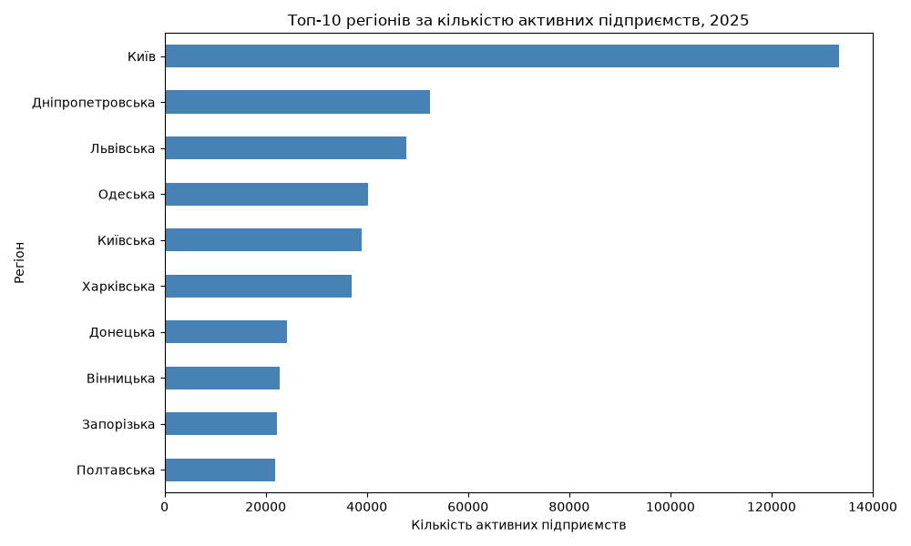
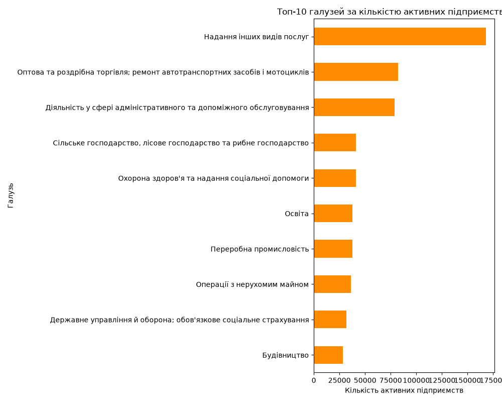
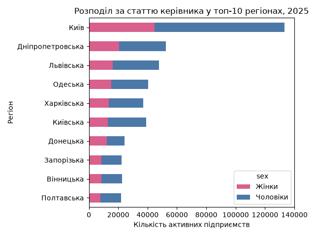
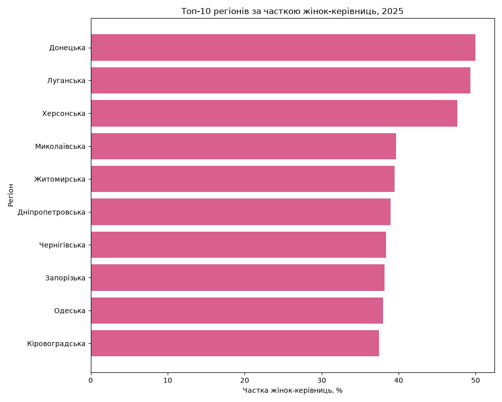
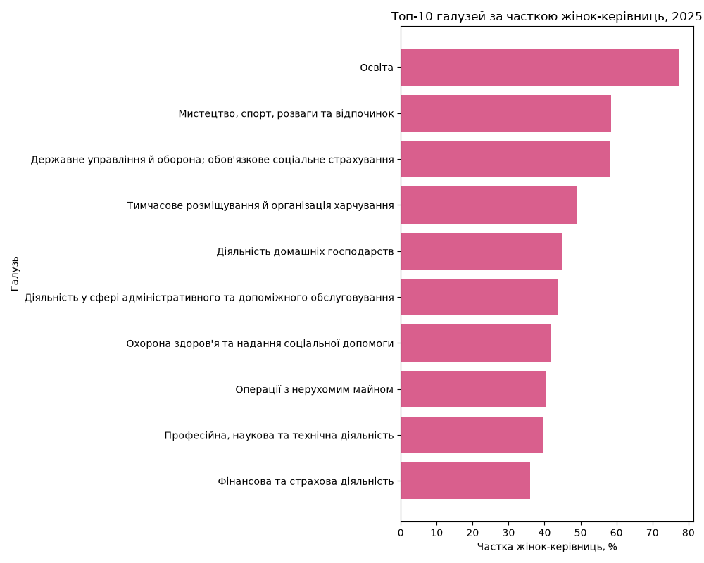
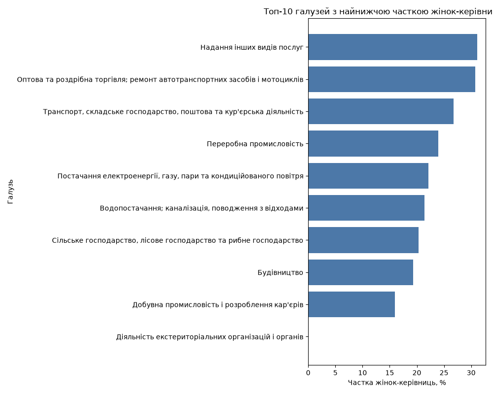
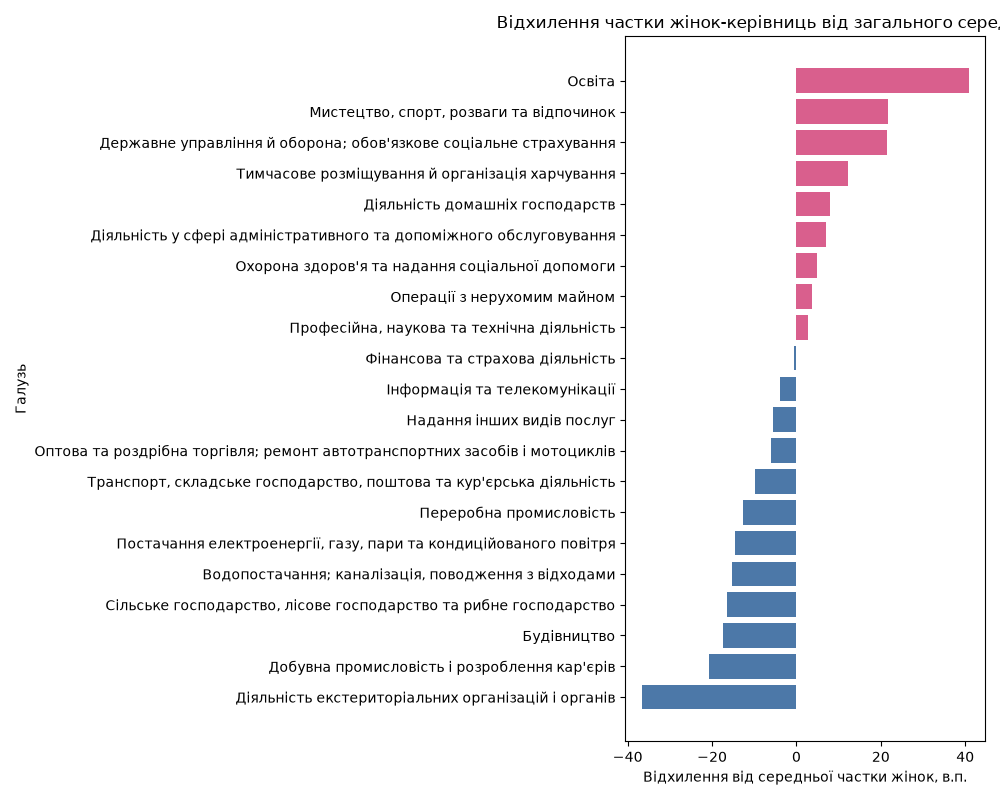

# Аналіз активних підприємств України за регіонами, галузями та статтю керівника (2025)

## Мета дослідження

Проаналізувати структуру активних підприємств України за регіонами, галузями та статтю керівника, щоб виявити регіональні й галузеві відмінності у представленості жінок і чоловіків на управлінських позиціях.

## Інтерактивна візуалізація

Повний інтерактивний дашборд з розподілом підприємств за регіонами, галузями та статтю керівника — на Tableau Public:
[Активні підприємства України, 2025](https://public.tableau.com/app/profile/volodymyr.voroshylov/viz/UkraineActiveEnterprises2025/2025)

Дашборд дозволяє фільтрувати за регіоном і переглядати деталізацію по галузях. Статичні графіки з ключовими висновками — нижче та в [docs/full_analysis.md](docs/full_analysis.md).


## Практична цінність

- **Для окремої людини:** аналіз допомагає краще зрозуміти, у яких галузях і регіонах управлінські ролі можуть бути більш або менш доступними.
- **Для бізнесу:** результати можуть бути орієнтиром для перевірки власної кадрової структури та ширини управлінського кадрового резерву.
- **Для громадських і освітніх організацій:** дані можуть бути основою для програм підтримки кар'єрного розвитку та лідерства у сферах з найбільшим дисбалансом.
- **Для державних органів:** аналіз може бути стартовою точкою для глибшого дослідження доступу до управлінських ролей у бізнесі та формування точкових програм підтримки підприємництва.

## Джерело даних

Джерело даних — Державна служба статистики України, [Банк даних stat.gov.ua](https://stat.gov.ua/).

Шлях у Банку даних:
**Бізнес-статистика → Реєстр респондентів статистичних спостережень (річна) → Кількість активних підприємств**
із розрізами:
- Територіальний розріз
- Вид економічної діяльності
- Стать керівника

## Обмеження джерела

Повний зріз даних у потрібному розрізі доступний лише за **2025 рік**. За попередні роки в цьому поєднанні змінних дані відсутні або неповні (див. `yearly_trend.png` — стрибок від 0 до ~1,34 млн у 2025 відображає не реальне зростання, а появу повного набору спостережень саме цього року). Тому дослідження є **одноперіодним (cross-sectional)** і не передбачає аналізу динаміки в часі.

## Візуалізації

### Загальна структура підприємств



### Гендерний розподіл






## Основні висновки

1. Найбільша кількість активних підприємств зосереджена в економічно сильніших регіонах України (Київ — 133 350, у 2,5 раза більше за другий регіон, Дніпропетровську обл. — 52 547) — підтверджує нерівномірну регіональну концентрацію бізнесу.
2. Галузева структура також нерівномірна: домінують "Надання інших видів послуг" (~168 тис.) і "Оптова та роздрібна торгівля" (~82 тис.), тоді як виробничі галузі (переробна промисловість, будівництво) суттєво менші.
3. Частка жінок-керівниць найвища в освіті (77,5%) і найнижча в добувній промисловості та будівництві (16–19%) — розрив у понад 4 рази між крайніми галузями.
4. Найбільше позитивне відхилення від середньої частки жінок (36,7%) — в освіті (+41 в.п.), найбільше негативне — серед екстериторіальних організацій (-37 в.п., але це найменша за обсягом галузь, лише 8 підприємств — результат статистично ненадійний через малу вибірку).
5. Галузевий патерн узгоджується із загальновідомим розподілом зайнятості (жінки частіше в освіті, охороні здоров'я, послугах; чоловіки — у видобутку, будівництві, важкій промисловості). Це означає, що високий чи низький показник по галузі, ймовірно, відображає загальну структуру зайнятості в секторі, а не специфічний бар'єр саме для управлінських позицій. Перевірити це припущення можна лише порівнянням частки жінок серед керівників із часткою жінок серед усіх зайнятих у тій самій галузі — таких даних у цьому наборі немає.
6. Регіони з найвищою часткою жінок-керівниць (Донецька, Луганська, Херсонська обл. — 48–50%) — це регіони з активними бойовими діями чи частковою окупацією, де загальна кількість активних підприємств значно менша за інші регіони. Високий відсоток тут може бути наслідком малої вибірки та специфічної структури бізнесу, що вижив у цих умовах, а не самостійним позитивним сигналом.

## Рекомендації

### Для окремої людини
- Варто звертати увагу на галузі та регіони, де частка жінок-керівниць вища, якщо ціль — розвиток управлінської кар'єри в більш відкритому середовищі.
- Під час планування кар'єри доцільно враховувати не лише розмір ринку, а й структуру доступу до керівних ролей.

### Для бізнесу
- Доцільно порівняти власну кадрову структуру з галузевим фоном.
- Якщо компанія працює в секторі з низькою часткою жінок-керівниць, варто перевірити, чи немає вузьких місць у наймі, просуванні та розвитку керівного резерву.

### Для громадських і освітніх організацій
- Варто спрямовувати програми розвитку лідерства в ті галузі, де гендерний дисбаланс найбільший і де вибірка достатньо велика для довіри до показника (не в галузі типу "екстериторіальні організації" з 8 підприємствами).
- Програми підтримки бажано робити галузево-специфічними, а не універсальними.

### Для державних органів
- Доцільно збирати детальніші дані: за розміром підприємства, типом власності, стажем керівника та динамікою за роками.
- Окремо варто зіставити частку жінок-керівниць із часткою жінок серед усіх зайнятих у відповідній галузі — без цього неможливо відрізнити "бар'єр для управлінських позицій" від "загальної структури зайнятості в секторі".
- Це дозволить перейти від опису структури до аналізу чинників нерівномірного доступу до управлінських ролей.

### Для державних органів
- Регіональна концентрація (Київ у 2,5 раза більший за другий регіон) — підстава для перегляду ефективності чинних регіональних податкових стимулів і програм децентралізації бізнесу.
- Слабка переробна промисловість відносно торгівлі та послуг (37 802 проти 167 866+82 072) — сигнал для профільних програм підтримки виробництва.
- Розкид частки жінок-керівниць від 16% (добувна промисловість) до 77,5% (освіта) — підстава для галузево-специфічних, а не універсальних програм підтримки жіночого лідерства.
- Доцільно збирати детальніші дані (розмір підприємства, тип власності, стаж керівника, динаміка за роками) та зіставити частку жінок-керівниць із часткою жінок серед усіх зайнятих у галузі — це дозволить перейти від опису структури до аналізу причин.

## Обмеження дослідження

- Дані показують лише розподіл (хто формально керівник), а не результат: набір не містить показників успішності — прибутковості, виживаності підприємства, продуктивності. Тому питання "в яких сферах жінки-керівниці досягають кращого результату" цими даними відповісти неможливо, лише "в яких сферах жінки частіше займають керівну посаду".
- Гіпотези про механізм галузевого розподілу (наприклад, чи впливає гендерний склад команди на ефективність управління, чи є специфічні бар'єри входу) непровірні цим набором: реєстр не містить даних про склад команди, кар'єрний шлях керівника чи механізм призначення. У README запропонована лише одна альтернативна гіпотеза (загальна структура зайнятості в галузі) — і вона теж не перевірена цими даними, а лише узгоджується із зовнішньо відомим фактом про розподіл зайнятості.
- Аналіз є описовим (correlational/descriptive), не причинно-наслідковим (causal): наявність зв'язку між галуззю і часткою жінок-керівниць не означає, що галузь є причиною цього розподілу.
- Дані не дозволяють оцінити ефективність управління залежно від статі керівника.
- Дані не дозволяють напряму оцінити економічні втрати або зробити міжнародні порівняння.
- Дослідження не містить повноцінного часового аналізу, оскільки повний набір доступний лише за 2025 рік.
- Показники по галузях/регіонах з малою кількістю підприємств (наприклад, екстериторіальні організації — 8 підприємств) статистично ненадійні й наведені лише для повноти картини.

## Структура репозиторію

```text
enterprises-analysis-ua/
│
├── raw.csv                         # сирий файл із Держстату (не зберігається в репозиторії)
├── clean_data.py                  # очищення і підготовка даних
├── analyze_data.py                # аналіз, агрегації та візуалізації
├── inspect_raw_data.py            # первинна перевірка структури сирого файлу
├── README.md
│
└── data_processed/
    ├── enterprises_clean.csv
    ├── top_regions.csv
    ├── top_activities.csv
    ├── sex_by_region.csv
    ├── women_share_by_region.csv
    ├── women_share_by_activity.csv
    ├── gender_gap_by_activity.csv
    ├── summary_metrics.csv
    ├── top_regions.png
    ├── activities.png
    ├── sex_by_region.png
    ├── women_share_top_regions.png
    ├── women_share_top_activities.png
    ├── women_share_bottom_activities.png
    └── gender_gap_activities.png
```

---

## Автор

**Володимир Ворошилов**
[GitHub](https://github.com/VoroshylovV)